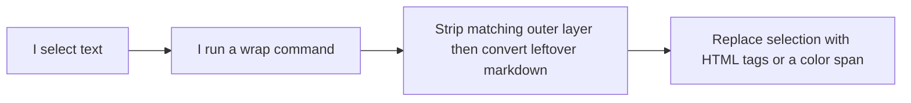

# Architecture (human-readable)

I keep this plugin small on purpose: one Obsidian plugin that wraps whatever I have selected in the editor.

## Where the code lives

- **`src/wrapLogic.ts`** — The pure text rules (no Obsidian UI). This is what the tests hit.
- **`src/main.ts`** — Registers commands, hotkeys, the mobile toolbar icons, and the settings screen for the color list.
- **`dist/main.js`** — The built file Obsidian actually loads. `push_to_prod` copies that plus `manifest.json` into my desktop vault and my iPhone vault.

## What wrapping does now

Each wrap command does two things before it adds its own tags:

1. If the whole selection is already that same kind of wrap (for example `**hello**` when I bold, or an existing color span when I color again), it peels that outer layer off once.
2. Then it walks the leftover text and turns markdown like `**…**`, `*…*`, and `~~…~~` into the matching HTML tags.

So wrapping `**hello**` with underline becomes `<u><b>hello</b></u>`, not `<u>**hello**</u>`.

## Colors

I pick a list of colors in settings (default is seven). There is no status bar. Each time I run the color command, it uses the next color in that list and remembers where it left off in that vault’s plugin data. Desktop and phone do not share that list or index unless I copy settings myself. A separate remove-color command strips color spans out of the selection and leaves other markup alone.
