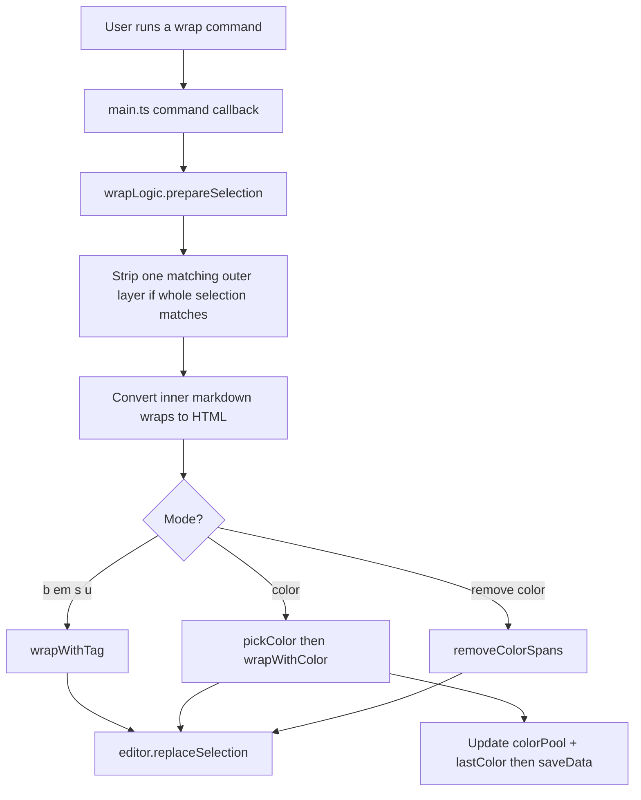
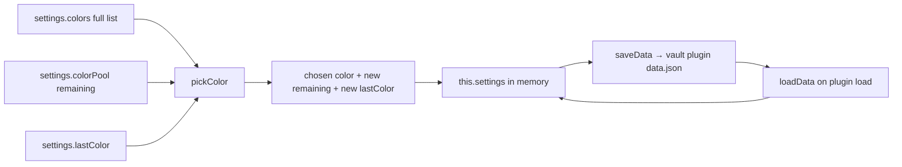
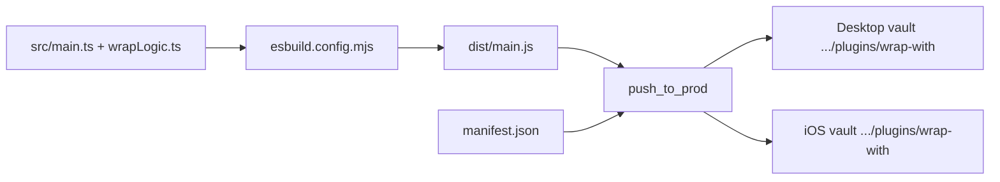

# Codebase map (human)

Maintainer-facing map of this repo: which files do what, how control/data move, and where state lives. Prefer diagrams over prose. Product rules and command details live in `scaffold/CODEMAP-LLM.md`. Install/run commands live in root `README.md`.

## What belongs here

- File / folder roles (what to open for which job)
- Control flow and data flow (diagrams preferred)
- Where state lives (in memory vs on disk, which fields)
- How build / deploy pieces connect (inputs → outputs → vaults)

Do **not** put here: hotkey tables, default palette hexes, detailed wrap/convert rules, install commands, or agent-only dense reference — those belong in CODEMAP-LLM or README.

## Files

| Path | Role |
|---|---|
| `src/wrapLogic.ts` | Pure text/color helpers (no Obsidian). Tests target this. |
| `src/main.ts` | Obsidian plugin: load/save settings, register commands + settings UI, call into `wrapLogic`. |
| `src/wrapLogic.test.ts` | Unit tests for wrap/color helpers. |
| `src/pushToProd.test.ts` | Checks the deploy script’s destinations / copy behavior. |
| `esbuild.config.mjs` | Bundles `src/main.ts` → `dist/main.js` (`obsidian` left external). |
| `manifest.json` | Plugin id/version metadata Obsidian needs alongside the bundle. |
| `dist/main.js` | Built artifact Obsidian loads (not edited by hand). |
| `push_to_prod` | Build, then copy `dist/main.js` + `manifest.json` into desktop and iOS vault plugin folders. |
| `scaffold/` | Agent rules, this map, LLM architecture reference, skills. |

## Control flow — wrap a selection

Tag wraps (`b` / `em` / `s` / `u`) go through shared `applyWrap` in `main.ts`. Color and remove-color have their own callbacks in `registerWrapCommands`.

## Data flow — color pool

`ColorPickState` in `wrapLogic.ts` is only the argument shape for `pickColor` (`remaining` + `lastColor`). It is not a separate store. `main.ts` maps `colorPool` ↔ `remaining` when calling `pickColor`.

## Where state lives

| What | Where |
|---|---|
| Full color list, leftover pool, last color used, italic-hotkey toggle | `WrapWithPlugin.settings` in memory while the plugin is loaded |
| Same fields persisted | Obsidian `saveData` / `loadData` — per vault under that vault’s `.obsidian/plugins/wrap-with/` (typically `data.json`) |
| Desktop vs iPhone | Separate vault plugin folders; no automatic sync between them |
| Editor selection / note text | Obsidian editor only — plugin does not keep a copy |

## Build and deploy

