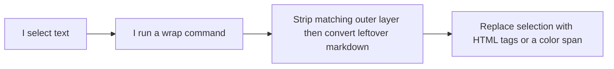

# Architecture (human-readable)

I keep this plugin small on purpose: one Obsidian plugin that wraps whatever I have selected in the editor.

## Where the code lives

- **`src/wrapLogic.ts`** — The pure text rules (no Obsidian UI). This is what the tests hit.
- **`src/main.ts`** — Registers commands, hotkeys, the mobile toolbar icons, the status bar color picker/lock popup, and the settings screen for the color list.
- **`dist/main.js`** — The built file Obsidian actually loads. `push_to_prod` copies that plus `manifest.json` into my desktop vault and my iPhone vault.

## Flow

Wrap commands strip one matching outer layer, convert known markdown inside the selection to HTML, then replace the selection with the requested HTML wrapper.

## Colors

Color state is stored in plugin data: saved colors, `nextColorIndex`, `oneShotColor`, and `lockedColor`. `src/main.ts` owns the Obsidian status bar popup and settings UI; `src/wrapLogic.ts` owns the pure color-choice rules.
